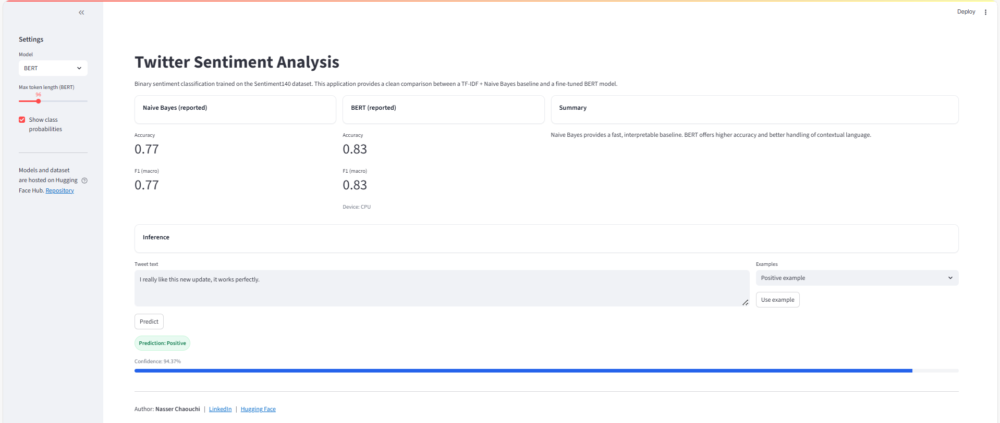

# Twitter Sentiment Analysis (BERT vs Naive Bayes)


This project focuses on **binary sentiment classification of tweets** using the **[Sentiment140 dataset](https://huggingface.co/datasets/nasserCha/twitter_sentiment_analysis)** (1.6M tweets).  
It compares a **classical ML baseline** (TF-IDF + Naive Bayes) with a **state-of-the-art deep learning model** (BERT fine-tuning).  

- End-to-end **NLP pipeline**: preprocessing → training → evaluation  
- **Comparison between Naive Bayes & BERT**  
- Dataset and models are hosted on **[Hugging Face Hub](https://huggingface.co/nasserCha/twitter_sentiment_analysis)**  
- Ready-to-use with **Streamlit app** or notebook  

---

## Streamlit Interface

Here is a preview of the application interface:



You can access the live application [here](https://twittersentimentanalysis-cfhbucvitpghzvnwxt38vi.streamlit.app/).


## Project Structure

- `twitter_sentiment_analysis.ipynb` – Full pipeline (EDA, preprocessing, modeling, evaluation)  
- `app.py` – Streamlit app for interactive sentiment prediction  
- `requirements.txt` – Dependencies  

### Hugging Face Resources

- **Dataset**: [`sentiment140.csv`](https://huggingface.co/datasets/nasserCha/twitter_sentiment_analysis)  
- **Models**:   
  - [`nb_tfidf_pipeline.pkl`](https://huggingface.co/nasserCha/twitter_sentiment_analysis/blob/main/models/nb_tfidf_pipeline.pkl) (Naive Bayes + TF-IDF pipeline)  
  - [`bert_sentiment_model`](https://huggingface.co/nasserCha/twitter_sentiment_analysis/tree/main/models/bert_sentiment_model) (Fine-tuned BERT model & tokenizer)  

---

## How to Run the Project Locally

### 1. Clone the repository

```bash
git clone https://github.com/nasser-chaouchi/twitter_sentiment_analysis.git
cd twitter_sentiment_analysis
```

### 2. Create and activate a virtual environment

```bash
python -m venv venv
source venv/bin/activate   
# On Windows: .\venv\Scripts\activate
```

### 3. Install dependencies

```bash
pip install -r requirements.txt
```

### 4. Run the Streamlit app
```bash
streamlit run app.py
```

## Models Used

Two different approaches were tested:

### Naive Bayes + TF-IDF (baseline)
- Fast and interpretable  
- Hosted as `nb_tfidf_pipeline.pkl` on Hugging Face  
- Lower accuracy  

### BERT Fine-tuned (state-of-the-art)
- High accuracy (~83%)  
- Handles context & semantics  
- Hosted as `bert_sentiment_model` on Hugging Face  
- Requires GPU for efficient training  

---

## Performance Summary

### Naive Bayes (Baseline)
- **Accuracy**: ~77%  
- **Macro F1-score**: ~0.77  

### BERT Fine-tuned
- **Accuracy**: ~83%  
- **Macro F1-score**: ~83 
- Handles ambiguous tweets far better than Naive Bayes  

---

## Built With

- Python  
- scikit-learn  
- pandas, numpy, matplotlib, seaborn  
- Hugging Face Transformers (BERT, Tokenizer)  
- PyTorch  
- Streamlit  
- joblib  

---

## Author

**Nasser Chaouchi**  
Machine Learning & Data Science  
[LinkedIn](https://www.linkedin.com/in/nasser-chaouchi/)  
[Hugging Face Repo](https://huggingface.co/nasserCha/twitter_sentiment_analysis)  

---

## License

This project is licensed under the [MIT License](LICENSE).
